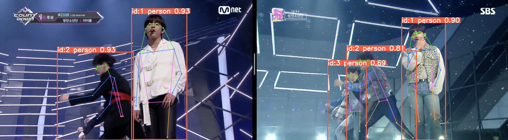
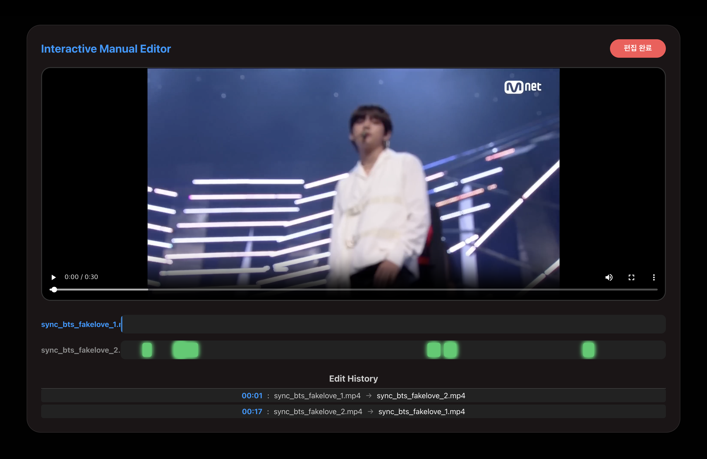

# Cross Editor Ai
## NVIDIA-2차-프로젝트-교차편집ai


## 프로젝트 설명
**기간:** 2024.05.29 - 2024.06.25 (4주)
**팀 구성:** 5명

이 프로젝트는 AI 기반의 영상 교차 편집 서비스입니다. 사용자가 업로드한 여러 영상을 분석하여 비트와 동작 유사도를 기반으로 자동으로 교차 편집 영상을 생성해줍니다. 또한, 사용자가 직접 타임라인을 보며 세밀하게 편집할 수 있는 수동 편집 기능도 제공합니다.

### 주요 기능
- **AI 분석 (YOLOv8 Pose Estimation):**
    
    - 업로드된 영상에서 사람의 관절(Pose)과 비트를 정밀하게 분석하여 최적의 전환 포인트(Transition Points)를 찾아냅니다.
    - 이 분석 데이터는 **자동 편집**과 **수동 편집** 모두의 핵심 기반이 됩니다.

- **자동 편집 (Auto Edit):**
    - AI가 분석한 데이터를 바탕으로 가장 자연스러운 전환 시점을 선택하여 교차 편집 영상을 자동으로 생성합니다.

- **수동 편집 (Manual Edit):**
    
    - **타임라인 시각화:** AI가 찾아낸 전환 포인트(초록색 블록)를 타임라인에 표시하여 사용자가 직관적으로 선택할 수 있습니다.
    - **실시간 미리보기 (Preview):** 타임라인을 재생하거나 스크러빙할 때, 편집된 순서대로 영상이 자동으로 전환되어 결과물을 즉시 확인할 수 있습니다.
    - **편집 히스토리 (Edit History):** 사용자가 수행한 모든 전환 작업(시간, 영상 변경 내역)이 리스트로 기록되어 편집 과정을 쉽게 추적할 수 있습니다.
    - **스마트 전환:** 전환 포인트를 클릭하면 해당 시점으로 이동하며, 자동으로 재생되지 않아 정밀한 편집이 가능합니다.
- **결과 확인 (Result):** 최종 렌더링된 영상을 웹에서 바로 재생하고 다운로드할 수 있습니다.

## 요구사항
- Node.js (버전 16 이상)
- Python (버전 3.11)
- CUDA 12.2 (GPU 가속 시)

## 설치 및 실행 방법

### 1. 레포지토리 클론
```bash
git clone https://github.com/LeeHonggii/Nvidiaproject.git
cd Nvidiaproject
```

### 2. 백엔드 (Python) 설정
루트 디렉토리에서 필요한 Python 패키지를 설치합니다.
```bash
pip install -r requirements.txt
```

서버를 실행합니다. (포트 8000)
```bash
python server/server.py
```

### 3. 프론트엔드 (React) 설정
`react-sever` 디렉토리로 이동하여 의존성을 설치하고 실행합니다.
```bash
cd react-sever
npm install
npm start
```
프론트엔드는 `http://localhost:3000`에서 접속할 수 있습니다.

## 프로젝트 구조
```plaintext
Nvidiaproject/
│
├── data/                  # 업로드된 영상 파일 저장소
├── images/                # README 및 프로젝트 이미지 리소스
├── react-sever/           # 프론트엔드 (React)
│   ├── public/
│   ├── src/
│   │   ├── pages/         # 주요 페이지 (Upload, Manual, Result)
│   │   ├── styles/        # CSS 스타일 파일
│   │   └── ...
│   └── ...
│
├── server/                # 백엔드 (FastAPI & AI Logic)
│   ├── server.py          # 메인 서버 실행 파일
│   ├── main.py            # 영상 분석 및 처리 로직
│   ├── video_editor/      # 영상 편집 유틸리티
│   └── ...
│
├── requirements.txt       # Python 의존성 목록
├── README.md              # 프로젝트 문서
└── .gitignore             # Git 제외 설정
```
